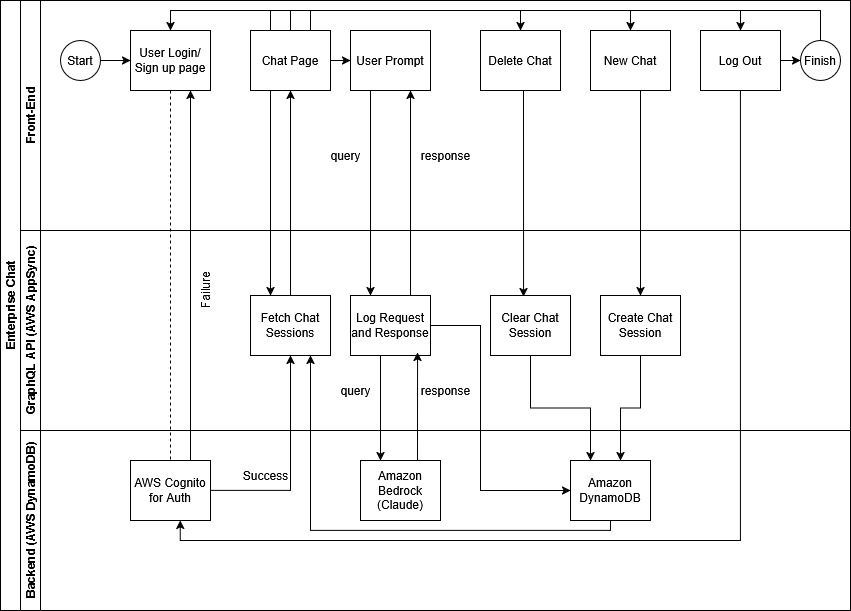
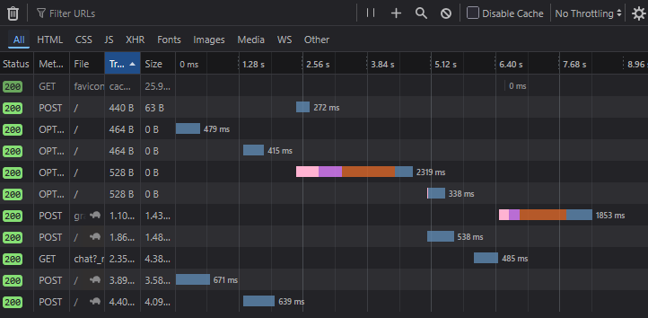
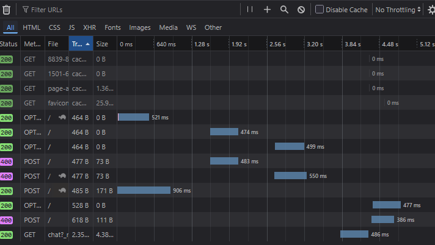
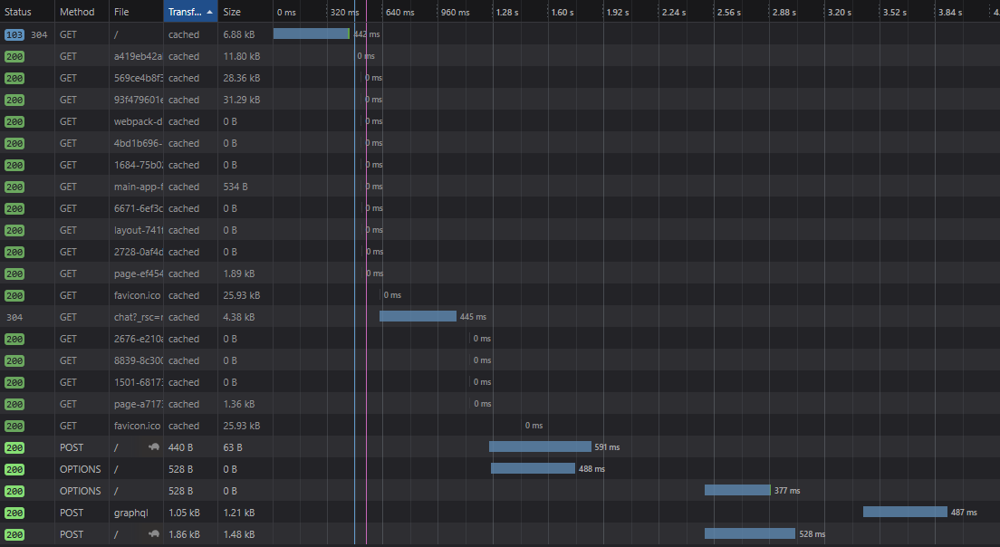
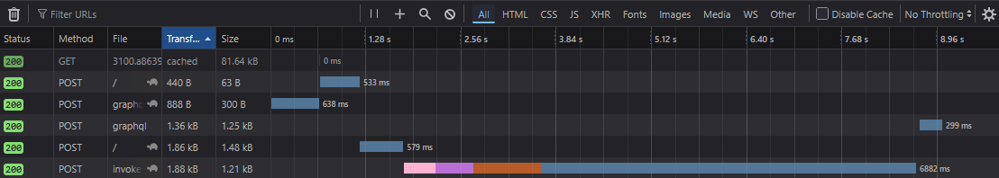
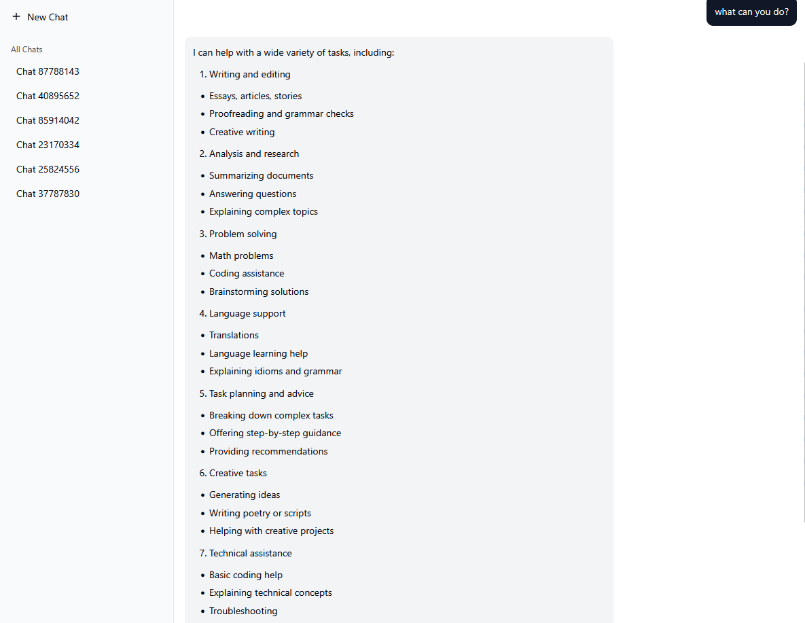

# Enterprise-AI-Chat-App
This code contains the code for our final project which was extended for this final project. The problem we aim to solve is that existing chatbots like chatgpt have a super usable and simple interface, but the models that they're using tend to focus on engaging users and giving a lot of extraneous information. We decided to implement a chatgpt-like interface, with the simplicity of Claude 3.5 Haikus responses. In the future we would like to allow the user to change different personalities, but as of now simplicity in the interface and the responses was critical.

**Note:** If using this application via the URL and signing up, please ensure the email has been verified before attempting to login.

## Introduction
The website for this project can be found [here](https://enterprise-ai-chat-app-abz6.vercel.app/login).

## High Level Design Diagram

The frontend of this website was built in React, the application is deployed on Vercel and calls a variety of AWS services to perform all the necessary actions including AWS AppSync (for the GraphQL API), Amazon DynamoDB (for the storing the chats), AWS Cognito (authentication), and Amazon Bedrock (for the Claude LLM)

## Security
Security was primarily handled through AWS as we used Cognito. All other sensitive AWS environment information was handled using environment variables so that it is harder to compromise.

Furthermore, emails are required to be verified before logging in which AWS Cognito also handles.

Additionally, allowing users to delete all of their chat sessions allows their information to stay private as it removes from our backend as well where we cannot access it.

In terms of Responsible AI practices, we didn't find it necessary to take explicit measures as in our testing, we found that Claude is natively restrictive in the nature of its responses.

### 1. Authentication & Access Control

- User authentication is handled via **AWS Cognito**, a secure and scalable identity provider.
- Only **authenticated users** can access chat sessions and send/receive messages.
- All GraphQL models use `@auth(rules: [{ allow: owner }])`, ensuring **users can only access their own data**.

### 2. Data Privacy

- User data (chat sessions, messages) is stored in **AWS DynamoDB** and isolated per user.
- No sensitive personal data is collected beyond email for authentication.
- Data is encrypted in transit and at rest via AWS services.

### 3. Responsible AI Use

- The application currently does **not call external LLMs**, only Amazon's model offerings.
- When integrated, prompts will be filtered, and responses will be validated to avoid:
  - Toxic or biased outputs
  - Personally identifiable information leaks
  - Misinformation

### 4. Data Retention & Deletion

- Users can manually delete individual chat sessions.
- Deleted sessions are removed from the database permanently.

### 5. Regulatory Alignment

| Regulation | Alignment |
|-----------|-----------|
| **GDPR** (EU) | No personal identifiers stored beyond email. Cognito is GDPR compliant. |
| **FERPA** (US) | No education data stored. Not applicable. |
| **HIPAA** (US) | No health data processed. Not applicable. |

### 6. AWS Compliance

This project relies on the AWS Amplify stack:
- Cognito, DynamoDB, AppSync
- All AWS services used are **compliant with SOC 2, ISO 27001, GDPR, and HIPAA** by default (see [AWS Compliance Programs](https://aws.amazon.com/compliance/programs/)).

### Code Quality and Testing
Code followed standard best practices, accounting for redundancies and containing sufficient comments to follow. Testing was mainly done manually but throughly, with intent to encompass main issues and potential edge cases.

### Summary

The application adheres to modern cloud and identity best practices. All user data is securely authenticated, scoped per user, and stored responsibly. Upon integration of AI, additional safeguards will be applied to ensure ethical and compliant use of language models.

## Deployment
In terms of deployment, a production build of this application was performed through the below command:
```(bash)
npm run build
```
This was then deployed onto Vercel by linking this GitHub repository.

## User Manual
1) Start off by visiting this [link](https://enterprise-ai-chat-app-abz6.vercel.app/login) to access the website.
2) Click the sign up button to create a new username and password, ensuring that they're valid formats.
3) Check your email address to verify your email on any device, just ensure that you only try logigng in after email verification is complete.
4) Once you are logged in successfully, you can start by clicking a new chat and beginning your conversation, you can then delete the chat, create a new one, or log out to finish the session.
5) Logging out will redirect to the login page and save all your chat sessions.

## API Documentation

Since we used AWS AppSync (GraphQL API) to make requests to our backend, we utilized the following schema:
```
type ChatSession @model @auth(rules: [{ allow: owner }]) {
  id: ID!
  title: String
  createdAt: AWSDateTime!
  messages: [ChatMessage] @hasMany(indexName: "bySession", fields: ["id"])
}

type ChatMessage 
  @model 
  @auth(rules: [{ allow: owner }]) {
  id: ID!
  chatSessionID: ID! @index(name: "bySession", sortKeyFields: ["createdAt"]) # ✅ fixed
  sender: String!
  message: String!
  createdAt: AWSDateTime!
}
```

Based on this schema AWS Amplify was able to auto-generate the functions necessary to make CRUD (Create, Read, Update, Delete) changes to our backend.

## Performance Analysis

Below are some of the front-end response times in various scenarios:

Logging in and chat fetching

Logging in only takes about 1.5s, fetching all the chats certainly takes quite a bit of time, and could be optimized.

Signing Up

It takes ~5s for the sign up to complete but within a second, the verification email is sent.

Fetching all chats for a logged in user:

~4s response to fetch 5 chats which weren't very long, therefore there is definitely room for optimization.

Large Prompt response:

~7s delay in the response for the following query:


In terms of the backend, there wasn't any concrete findings regarding the latency of the backend AWS systems but it certainly adds overhead which can be reduced. One of the recommended strategies to reduce latency is to batch requests.

Due to the high reliance on AWS services, this application supports elasticity as it automatically scales resources as necessary.
